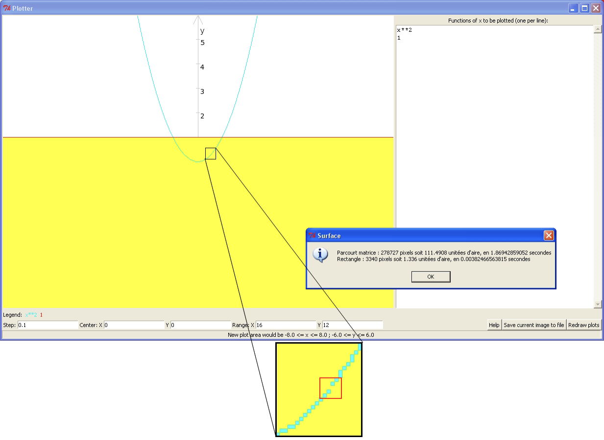

# Quickstart

`python2 src/plotterGUI.py`

# Introduction

Dans le cadre de mes études à l'ULB, j'ai créé ce projet pour mon projet
d'année.

Le but du projet est réaliser un programme en Python permettant de créer
une image affichant plusieurs fonctions graphiques. Plusieurs données
doivent être prises en compte lors du dessin : range_x représente le
nombre d'unités sur l'axe des x, range_y représente le nombre d'unités
sur l'axe des y, step représente l'écart entre deux valeurs calculées,
center \_x et center_y représente les coordonnées qui se trouveront au
milieu du graphique, output défini le chemin du fichier de sortie et
func représente les fonctions à tracer par le graphique. La solution
choisie fut de créer une matrice représentant cette image PPM, il
fallait créer cette matrice et écrire des fonctions qui dessineront les
axes, les ticks, les fonctions ... Le tout prenant compte des arguments
donnés.

L'obtention de cette image se fait soit en utilisant l'interface
graphique via plotterGUI.py ou par ligne de commande via plotter.py.

Depuis l'interface graphique, nous pouvons calculer l'aire entre
plusieurs fonctions par un clic droit.

Ce projet a pour but de solliciter des compétences vues au cours de
programmation, de trouver des solutions par soi-même, d'exploiter la
compétence de communication avec ce rapport et la future présentation
orale.

Ci-dessous vous trouverez une explication de chaque module et de chaque
fonction s'y trouvant ainsi que l'explication du 'main'.

# FctMgr.py

Ce module contient toutes les fonctions nécessaires à la création d'une
matrice représentant un graphique de fonction. Pour nous en servir nous
devons importer la librairie math pour éviter une surcharge d'écriture.
Il faut aussi importer le module config pour obtenir les variables de
taille et de largeur de l'image, la taille des ticks et les différentes
couleurs de l'image. Le module symbol contient un dictionnaire de
matrice représentant divers symboles, utiles pour la fonction
drawSymbol.

## drawLine

Pour tracer les fonctions, la première étape est de tracer une ligne
entre deux points et ainsi calculer deux nouveaux points à chaque fois
selon la fonction.

La fonction drawLine trace une ligne dans la matrice M entre deux pixels
M\[x1\]\[y1\] et M\[x2\]\[y2\]. La fonction commence par calculer la
direction dans laquelle la pente augmente le plus pour tracer la ligne
vers x ou y.

Elle fonctionne de la manière suivante :
```
Hypothèse : x2 > x1
Si |y2 - y1| est inférieure ou égale à  |x2 - x1| (la pente est faible) :
     La pente vaut (y2 - y1)/(x2 - x1)
     Pour x allant de x1 à x2 par pas de 1, et y allant de y1 à y2 par pas de pente :
	Si les valeurs de x et de y ne sont pas hors de l’image :
		Tracer le pixel (x,y)
Sinon (la pente est forte) :
	La pente vaut (x2 - x1)/(y2 - y1) 
	Si y1 est supérieur à y2 :
		Inverser (x1,y1) et (x2,y2) 
	Pour y allant de y1 à y2 par pas de 1, et x allant de x1 à x2 par pas de pente :
	Si les valeurs de x et de y ne sont pas hors de l’image :
		Tracer le pixel (x,y)  
```

## drawSymbol

Cette fonction permet de dessiner des symboles dans le graphique à une
coordonnée donnée. Il a d'abord fallu créer un dictionnaire contenant
une matrice 13\*8 de nombre représentant des symboles. Une fois ceci
fait, cette fonction reçoit une coordonnée x, y ainsi qu'un symbole et
ensuite, ce symbole est placé à la coordonnée donnée dans la matrice.

Pour placer ce symbole, il suffit de placer la matrice représentant le
symbole dans la matrice représentant le graphique.

## drawAxes

La fonction drawAxes permet de tracer les axes selon le centrage de x et
y. Il est demandé de tracer le graphique avec, au centre de celui-ci le
point (centrage_x, centrage_y). Si les axes sont hors du graphique, ils
doivent coller les bords de l'image, sinon ils sont tracés à l'endroit
cohérent dans l'image.

Pour tracer l'axe x correctement, il faut premièrement prendre la plus
grande valeur entre 0 et le la coordonnée y = 0 du graphique transformé
en coordonnée matrice grâce à la fonction yToy_i. Après ça, nous devons
voir laquelle des valeurs est la plus petite entre celle que nous venons
de calculer et la hauteur de la matrice.

Si la center_y est inclus dans le graphique, alors l'axe x sera placé,
sinon il sera soit collé sur la gauche soit sur la droite en selon la
position à gauche ou à droite du graphique du center_y. Une fois que
nous avons cette coordonnée, nous traçons une ligne allant du début de
l'image avec la coordonnée y jusqu'à la fin de l'image avec la
coordonnée y.

Durant cette étape nous définissons aussi l'emplacement y des symboles
sur l'axe x. Si la coordonnée y de l'axe est supérieur à deux fois la
taille des symboles, la coordonnée y des symboles est la coordonnée y de
l'axe y à laquelle on soustrait l'espace entre l'axe et les symboles
ainsi que la taille des symboles. Sinon, cette coordonnée est la
coordonnée y de l'axe y additionnée avec l'espace entre l'axe et les
symboles.

Une fois l'axe tracé et la coordonnée y des symboles calculés, on trace
la flèche au bout de l'axe grâce à deux lignes et le symbole x au bout
de l'axe grâce à la fonction drawSymbol.

Enfin nous devons dessiner les ticks à chaque unité ainsi que le nombre
correspondant. Pour ce faire, à chaque unité x entre sur l'axe,
c'est-à-dire chaque unité entre moins le range_x additionné avec le
center_x et le range_x additionné avec le center_x, nous calculons la
coordonnée graphique correspondante avec xTox_i, nous plaçons une ligne
verticale de la taille des ticks pour le tick et nous dessinons le
nombre actuel du graphique à la position x du graphique et y calculée
grâce à la fonction drawNumber.

```
Définir la position y de l’axe x en prenant la plus petite valeur entre (la hauteur de l’image et la plus grande des valeurs entre (0 et la cordonnée y 0 sur le graphique))
Si la position y de l’axe x est supérieure à deux fois la hauteur des symboles :
    La coordonnée y des symboles est la position y de l’axe x moins l’espace entre l’axe et les symboles moins la hauteur des symboles
Sinon :
    La coordonnée y des symboles est la position y de l’axe x plus l’espace entre les symboles et l’axe
Tracer une ligne sur toute la largeur de l’image à la position y de l’axe x pour l’axe x
Tracer deux lignes à l’extrémité droite de l’image pour la flèche
Dessiner le symbole ‘x’ à l’extrémité droite de l’image
Pour chaque unité représentée sur l’axe :
    Calculer sa position sur l’image
    Tracer le tick à cette position
    Dessiner l’unité à cette position avec la position y des symboles
```

Pour tracer l'axe y, nous devons prendre la plus petite valeur entre la
largeur de l'image et la coordonnée 0 du graphique transformée en
coordonnée de l'image grâce à xTox_i. Ensuite prendre la plus grande
valeur entre la valeur précédemment calculée et le 0. Cette valeur sera
la coordonnée x de l'axe y.

On recherche aussi la coordonnée x des symboles qui seront placés cet
axe. Si la coordonnée x de l'axe est inférieure à la largeur de l'image
moins deux fois la largeur des symboles, la coordonnée x des symboles
sera la coordonnée x de l'axe additionnée à l'espace entre l'axe et les
symboles, sinon la coordonnée x des symboles sera la coordonnée x de
l'axe à laquelle on soustrait l'espace entre l'axe et les symboles ainsi
que la largeur des symboles.

Une fois ces données calculées nous traçons l'axe y, la flèche au bout
et le symbole y au bout.

Pour tracer les ticks et les nombres, nous commençons par savoir si on
placera les nombres à droite ou à gauche de l'axe en vérifiant si la
taille maximale de caractère d'un nombre additionnée à la coordonnée x
des symboles sera plus grande que la largeur de l'image, si c'est le
cas, on place les symboles à gauche, sinon à droite.

Enfin, pour chaque unité sur l'axe y, c'est-à-dire toutes les unités
entre moins le range_y plus le center_y et le range_y plus le center_y,
nous commençons par transformer l'unité y graphique en unité de l'image
grâce à yToy_i, nous traçons une ligne horizontale à la coordonnée
calculée de la taille d'un tick pour le tick et nous y plaçons à côté le
numéro avec la fonction drawNumber.

```
Définir la position x de l’axe y en prenant la plus grande valeur entre (0 et la plus petite des valeurs entre (la largeur de l’image et la cordonnée x 0 sur le graphique))
Si la position x de l’axe y inférieure à la largeur de l’image moins deux fois la largeur des symboles :
    La coordonnée x des symboles est la position x de l’axe y plus l’espace entre l’axe et les symboles
Sinon :
    La coordonnée x des symboles est la position x de l’axe y moins l’espace entre les symboles et l’axe moins la largeur des symboles
Tracer une ligne sur toute la hauteur de l’image à la position x de l’axe y pour l’axe y
Tracer deux lignes tout en haut de l’image pour la flèche
Dessiner le symbole ‘y’ tout en haut de l’image
Si la taille du nombre le plus grand plus la position x de l’axe y est supérieur à la largeur de l’image :
    On soustrait la taille du plus grand nombre à la position x des symboles
Pour chaque unité représentée sur l’axe :
    Calculer sa position sur l’image
    Tracer le tick à cette position
    Dessiner l’unité à cette position avec la position x de l’axe y
```

## drawNumber

Cette fonction dessine un nombre dans la matrice à une coordonnée
demandée. Pour ce faire, pour chaque chiffre ou symbole (le moins) du
nombre on dessine le symbole à l'emplacement demandé grâce à la fonction
drawSymbol et on augmenta l'emplacement x du prochain symbole de la
largeur d'un symbole.

## xTox_i et yToy_i

Cette fonction transforme les coordonnées graphiques en indice pour la
matrice. Pour ce faire nous commençons par calculer le rapport de x
valant rapport entre la largeur de l'image et le range de x et le
rapport de y valant le rapport entre la hauteur de l'image et le range
de y, ces valeurs permettent de transformer une valeur dans une image de
taille range_x\*range_y en une valeur pour une image de taille
width\*height. Pour transformer les coordonnés graphiques de x en
coordonné pour l'image de x, il faut multiplier le rapport de x avec
l'addition du x donné et la demie du range de x et la soustraction du
centrage de x.

X étant initialement --range_x/2, il faut l'additionner pour récupérer
le x de l'image, il faut ensuite additionner le centrage de x si on veut
que la fonction soit centrée aussi.

La conversion du y se fait de la même façon sauf qu'il faut multiplier
le rapport de y par la soustraction du range de y demie par le y calculé
et l'addition du centrage de y.

## x_iTox et y_iToy

Cette fonction transforme les indices pour la matrice en coordonnées
graphiques. Il s'agit simplement de faire l'inverse des fonctions xTox_i
et yToy_i.

## drawFunc

Pour tracer les fonctions, nous allons tracer des lignes entre deux
coordonnées calculées. Il faut commencer par définir le premier x à
calculer, il s'agit de la soustraction entre l'opposé du range de x et
du centrage de x. Nous définissons x_old et y_old à la valeur None. Nous
définissons x_i comme la conversion de x en indice de la matrice. Nous
essayons ensuite de calculer la valeur y, c'est-à-dire la fonction
calculée à x. Nous définissons y_i comme la conversion de y en indice de
la matrice. Après ça, nous vérifions que x_old ne vaut pas None, qu'il
n'y a pas un très grand écart entre les deux coordonnées à calculer,
ceci permet d'éviter des asymptotes dessinées, enfin nous vérifions
qu'au moins un des points à dessiner sera dans la matrice, si on ne
passe pas par cette étape, on fera beaucoup de calcul supplémentaire
inutile. Si toutes ces conditions sont remplies, on trace la ligne entre
les deux points. On définit alors x_old et y_old à x_i et y_i.

S'il y a eu une erreur de calcul durant le calcul de la fonction,
exemple : une division par 0, on met x_old et y_old à None. S'il y a eu
une erreur d'overflow, un nombre trop grand ou avec trop de nombres
après la virgule, on continue en diminuant légèrement le nombre très
grand ou en arrondissant le nombre à virgule.

On ajoute le step à x et on redéfinit x_i et on refait ce cheminement
tant que x_i est inférieur à la largeur de l'image.

Pseudo-code de la fonction :

```
x1 vaut l’opposé de la du range de x plus le centrage de x
x_old et y_old valent None
x_i vaut la conversion de x
Tant que x_i est inférieure à la largeur de l’image :
    Essayer :
        Calculer la valeur de y et la convertir
        Si x_old ne vaut pas None et qu’il n’y a pas un écart extrêmement large entre les deux points:
            S’il y a au moins un point dans le graphique :
                Tracer la ligne entre (x_old, y_old) et (x_i, y_i)
        x_old vaut x_i
        y_old vaut y_i
    S’il erreur de type nombre trop grand ou trop de nombre après la virgule :
        Si le nombre est trop grand le diminuer un peu
        Sinon arrondir un peu le nombre
        Recommencer le même cheminement
    S’il y a n’importe quelle autre erreur :
        x_old et y_old valent None
    Incrémenter x de step
    Reconvertir x
```

## Plot

En premier lieu, cette fonction crée une matrice de la taille
HEIGHT\*WIDTH, soit la largeur et la hauteur de la matrice récupérée
dans le module config.py, cette matrice est de base remplie de la valeur
BG, le background de l'image. Une fois ceci fait elle appelle la
fonction drawAxes pour dessiner dans la matrice les axes, les ticks, les
numéros, le x et le y. Elle appelle ensuite autant de fois la fonction
drawFunction qu'il n'y a de fonctions avec, à chaque fois, une couleur
différente pour la fonction.

# PPMMgr.py

Ce module permet d'appeler la fonction matrixToFile.

## matrixToFile

Cette fonction transforme une matrice de tuples en une image PPM. Pour
commencer ce fichier, il faut écrire P3 pour préciser que nous sommes en
PPM brute. Ensuite le nombre de colonnes de l'image, dans notre cas la
longueur de la liste M pour le nombre de lignes et la longueur d'une
liste dans la liste M pour le nombre de colonnes. Et enfin la borne
supérieure pour les valeurs des intensités (dans notre cas, nous aurons
toujours 255).

Après la configuration donnée, il faut écrire chaque pixel, ceux-ci sont
représentés par trois nombres qui donnent une couleur en RVB. Chaque
pixel doit être séparé par une tabulation et chaque ligne de pixels par
un retour à la ligne.

Nous obtiendrons donc :

```
Écrire dans le fichier : P3, à la ligne, longueur de M longueur d’une liste de M, à la ligne, 255
Pour chaque ligne de la matrice :
    Pour chaque colonne de la matrice :
        Pour chaque membre du tuple :
            Écrire dans le fichier : le membre du tuple 
        Écrire dans le fichier : tabulation
    Écrire dans le fichier : à la ligne
```

# symbol.py

Le module symbol contient un dictionnaire de matrice représentant divers
symboles, utiles pour la fonction symbolInM. Chaque matrice contient un
nombre qui forme une variation de gris en RGB, en effet, il suffira de
tripler la valeur contenue dans la matrice pour obtenir une couleur. La
clef du dictionnaire définit le symbole qui est représenté dans la
valeur de cette clef.

# config.py

Le module config contient les variables de taille et de largeur de
l'image, la taille des tick et les différentes couleurs de l'image.

# plotter.py

Ce fichier est le 'main' du programme. Nous commençons par importer la
librairie nécessaire au programme, c'est-à-dire argparse, qui va nous
permettre de lancer le programme via une console, ensuite nous importons
le module FctMgr qui contient toutes les fonctions nécessaires pour
tracer un graphique et le module PPMMgr qui permet de convertir la
matrice résultante de la fonction plot en image ppm.

Après les importations, le système qui permet de lancer le programme
depuis la console est implémenté. Les valeurs optionnelles sont :
```
-o output -- fichier de sortie, valeur par défaut : out.ppm ;
-s step -- pas, valeur par défaut : 0,1 ;
--xrange range_x -- intervalle horizontal, valeur par défaut : 10 ;
--yrange range_y -- intervalle vertical, valeur par défaut : 10 ;
--xcenter center_x -- centre horizontal, valeur par défaut : 0 ;
--ycenter center_y -- centre vertical, valeur par défaut : 0 ;
-h help -- aide.
```

Une fois les valeurs recueillies, on les assigne à des variables.

On appel ensuite la fonction plot avec les arguments donnés et ensuite
on converti cette matrice en image ppm grâce à la fonction matrixToFile.

# plotterGUI.py

Ce fichier incorpore les fichiers précédemment créés en y ajoutant une
interface graphique le rendant interactif. Pour pouvoir utiliser les
précédents fichiers ont les importes en tant que modules, on importe
donc FctMgr, PPMMGR et config. On importe aussi le module Tkinter qui
permet de créer des interfaces graphique sous python, on utilise aussi
les module tkFileDialog qui permet de de modifier des fichiers, le
module tkMessageBox qui permet de faire des boites de dialogues. On
importe enfin la fonction clock du module time qui permettra de
connaitre le temps d'exécution des fonctions.

Le main crée une fenêtre et appel la class plotterGUI en lui passant la
fenêtre.

## plotterGUI 

Cette classe va créer l'interface graphique du programme.

Elle commence par renommer la fenêtre, elle sauvegarde les attributs de
base de l'image dessinée et appellera la méthode création.

### creation

La méthode commence par calculer un graphique vide qui servira d'image
de base. On construit ensuite un canevas de taille 800\*600, on appel la
méthode matrixToCanvas qui transformera la matrice en image qui sera
placée dans le canevas. La fonction calculeSurface se lancera lors ce
qu'on cliquera avec le clic droit sur le canevas. On place le canevas en
haut à gauche de l'image.

On crée maintenant la zone qui accueillera les fonctions, on crée une
frame, on y met le titre en haut, on place une barre de défilement sur
la droite, et on ajoute une zone de saisie, on positionne cette frame
sur la droite de l'interface.

On s'occupe maintenant des légendes, on crée une liste qui contiendra
les légendes, on crée une frame, on y ajoute le titre et on place cette
frame en bas du graphique.

Nous ajoutons les options, nous créons une frame dans laquelle nous
ajoutons le titre step et une zone de texte à côté. Nous y insérons
ensuite un label avec le titre « Center x » et une zone de saisie à coté
à laquelle nous ajoutons deux méthodes, bindKey lors ce qu'elle prend le
focus et unbindKey lors ce qu'elle le perd. Nous ajoutons les mêmes
éléments pour center y, range x et range y. Enfin nous plaçons cette
frame en dessous des légendes.

On construit une zone pour les boutons, on commence par créer une frame
dans laquelle on y place les boutons « Help » qui affichera l'aide,
« Save current image to file » qui sauvegardera l'image courante et
« Redraw plots » qui retracera le graphique en fonction des données
inscrites. On place cette frame à la droite des options.

Enfin nous ajoutons une zone de statut qui affichera le prochain
centrage du graphique en fonction des valeurs introduites dans les
options, cet élément se trouve tout en bas de la fenêtre.

### matrixToCanvas

Cette méthode crée une image selon une matrice, puis l\'affiche dans un
canevas. On commence par supprimer l'image précédente dans le canevas,
on créer une image vierge de la taille 800\*600, ensuite on crée une
chaine de caractère vide. Pour chaque tuple de la matrice, on le
transforme en hexadécimale, chaque ligne est entre accolades. On ajoute
dans l'image la chaine de caractère qui représente la matrice et ajoute
cette image dans le canevas.

Pseudo-code :

```
Supprimer l’image du canevas
Créer une nouvelle image 800*600
Créer une chaine de caractère vide
Pour chaque colonne de la matrice :
    Ajouter ‘{‘ à la chaine de caractère
    Pour chaque ligne de la matrice :
        Ajouter la couleur en hexadécimal correspondant à la couleur actuel
    Ajouter ‘} ‘ à la chaine de caractère
Convertir la chaine de caractères en image
Mettre l’image dans le canevas
```

### replot

Méthode qui, si les valeurs sont correctes, redessine le graphique et
actualise la légende.

On commence par vérifier si les différentes options pour tracer les
fonctions sont correctes grâce à la méthode verifyValues, si c'est le
cas, on récupère les valeurs des différentes options et on les met dans
les attributs de la class. On dessine ensuite les fonctions dans une
nouvelle matrice grâce à la méthode plot, ensuite on affiche le
graphique grâce à la méthode matrixToCanvas et enfin on met à jour la
légende grâce à la méthode setLegend.

Pseudo-code :

```
Si les valeurs sont correctes :
    Récupérer les valeurs
    Tracer le nouveau graphique dans la matrice
    Transformer la matrice en canevas
    Mettre à jour la légende
```

### setLengend

Cette méthode affiche la légende.

Premièrement on détruit la légende précédente grâce à la méthode
destroyCurrentLegend, ensuite, pour chaque fonction tracée, on crée un
label dans la frame de la légende, ce label affiche le nom de la
fonction dans la couleur de celle-ci, pour cela on utilise la méthode
getPaletteColor, après ça, on ajoute le label dans une liste.

Pseudo-code 
```
Détruire la légende précédente
Pour chaque fonction :
    Créer un label affichant la fonction dans la couleur de la fonction
    Afficher ce label
    Ajouter ce label à la liste des labels
```

### destroyCurrentLegend

Cette Méthode détruit la légende actuelle.

Pour chaque label dans la liste des légendes, on le détruit. On
réinitialise la liste des légendes comme vide.

Pseudo-code :
```
Pour chaque label dans la liste des labels :
    Détruire le label
Réinitialiser la liste des labels
```

### getPaletteColor

Cette méthode transforme un tuple de couleur RGB en un string
hexadécimal.

On convertit le tuple en hexadécimale et on le retourne.

### setStatut

Cette méthode met à jour la barre de statut en fonction des valeurs dans
les labels d\'options.

Dans un premier temps, on récupère range_x, range_y, center_x et
center_y dans les zones de saisies. On vérifie que toutes les valeurs
sont réelles grâce à la méthode isReal, si ce n'est pas le cas on
affiche l'erreur dans la barre. Ensuite on vérifie que les deux ranges
sont positifs, si ce n'est pas le cas on affiche l'erreur dans la barre.
Enfin si toutes les conditions sont passées, on calcul la nouvelle
surface qui sera tracée et on l'affiche dans la barre de statut.

Pseudo-code :
```
Récupérer les valeurs des options
Si elles sont toutes réelles :
    Si range_x et range_y sont positives :
        Afficher dans la barre de statut la prochaine surface affichée, c'est-à-dire (center_x - range_x/2, center_y - range_y/2) jusque (center_x + range_x/2, center_y + range_y/2)
    Sinon :
        Afficher l’erreur
Sinon :
    Afficher l’erreur
```

### bindKey et unbindKey

La méthode bindKey ajoute à l\'objet qui a le focus la fonction
setStatut lors ce qu\'une touche est relâchée, contrairement à unbindKey
qui supprime de l\'objet qui perd le focus la fonction setStatut lors ce
qu\'une touche est relâchée.

Ces méthodes sont appelées lors ce que le focus rentre ou sort des zones
de saisies des options, elles ajoutent ou supprime le fait que, lors ce
qu'une touche est relâchée, on appel la méthode setStatut, ce qui permet
que la barre de statut soit toujours à jour.

### isReal

Cette méthode vérifie si un nombre donné en chaine de caractère est un
réel.

Pour vérifier ceci, on essaye de transformer le la chaine de caractère
en un nombre décimal, s'il y a une erreur on renvoie False, sinonTrue.

### save

Cette méthode sauvegarde le graphique affiché dans un fichier choisi.

Pour ce faire on utilise la fonction asksaveasfilename du module
tkFileDialog, avec comme extension par défaut : ppm. Si le nom du
fichier est différent de la chaine de caractère vide (qu'on obtient si
on quitte la fenêtre), on utilise la fonction matrixToFile du module
PPMMgr, y passant le nom du fichier et la matrice.

### verifyValues

Cette méthode vérifie que les valeurs entrées permettent de tracer un
graphique et affiche un message détaillant l'erreur s'il y en a une.

On commence par récupérer toutes les valeurs des zones de saisies
d'options, on initialise un message d'erreur, et on met le résultat de
base à True. Ensuite, on vérifie chaque erreur, s'il y en a
effectivement une, on ajoute le détail de l'erreur dans le message
d'erreur, on met le résultat à False et on continue pour chaque erreur.
Les erreurs vérifiées sont : un step non réel, un step négatif, un
range_x non réel, un range_x négatif, pareil pour range_y, un center_x
non réel, pareil pour center_y et enfin que la ou les fonctions soient
corrects. S'il y a eu une erreur, on affiche le message d'erreur et on
retourne le résultat.

### helpPlotter

Cette méthode affiche l\'aide.

On affiche simplement dans un pop-up le contenu de l'attribut
helpString, cette dernière étant le contenu du fichier help.txt.

### computeArea

Cette méthode calcul la surface demandée selon deux méthodes, affiche le
résultat et le temps d\'exécution de chacune d\'elles.

Comme cette méthode est appelée lors ce qu'on fait un clic droit sur le
canevas, on reçoit les coordonnées x et y du clic, on appel ensuite les
deux méthodes, qui nous retourne le nombre de pixels de la surface ainsi
que leurs temps d'exécution. On récupère le rapport des unités par
pixels grâce à la méthode unitByPixel, qui, multipliée par le nombre de
pixels, nous donne l'aire correspondante. On actualise le graphique ou
la surface calculée sera colorée et on affiche un pop-up reprenant
toutes les informations.

### browseMatrix

Cette méthode calcul le nombre de pixels de l\'aire selon la méthode 1
donnée dans l'énoncée, soit la méthode du parcourt de la matrice.

Le principe de cette méthode est de parcourir tous les points entre les
fonctions.

En premier lieu, on récupère le moment où la méthode a commencé grâce à
la fonction clock. On initialise la taille de l'aire en pixel à 0 et on
vérifie que le point choisi est bien une surface, c'est-à-dire que sa
couleur est soit la couleur de fond, soit un niveau de gris, donc par
conventions, un axe ou un symbole.

Si la surface à calculer est bien une surface, on crée la liste des
points avec le point de base dedans, pA représentera un point de la
liste des points, tant que cette lise ne sera pas vide, on continuera
d'exécuter en boucle les instructions suivantes. On retire le dernier de
la liste et on le donne à une variable, si ce point n'est pas déjà
calculé, donc qu'il n'est pas déjà de la couleur des surfaces calculées,
on augmente la taille de l'aire de 1, on colorie le point de la matrice
en la couleur des surfaces calculée, on crée une liste comprenant les 4
points adjacents au point actuel, pour chacun de ces points, si le point
est dans l\'image et qu\'il ne soit pas déjà de la couleur d\'aire et
qu\'il soit soit de la couleur de fond soit qu\'il est d\'un niveau de
gris, on l\'ajoute dans la liste des points.

On calcule le temps total d'exécution en soustrayant au moment actuel
obtenu grâce à la fonction clock le moment de départ sauvegardé dans une
variable. On retourne la taille de l'aire en pixel et le temps
d'exécution.

Le pseudo-code suivant détail cette méthode :

```
On récupère le moment où la méthode à commencer grâce à la fonction clock
On initialise la taille de l’aire en pixel à 0
Si le point choisi est bien une surface, c’est-à-dire que sa couleur est soit la couleur de fond, soit un niveau de gris :
    On crée la liste des points avec le point de base dedans
    Tant que cette liste n’est pas vide :
        On prend le dernier point de la liste et on le supprime de la liste
        Si ce point n’est pas déjà coloré en la couleur des surfaces calculées :
            On augmente la taille de l’aire en pixel de 1
            On colorie le point en la couleur correspondante
            On crée une liste comprenant les quatre points adjacents au point actuel
            Pour ces quatre points :
                Si le point est dans l'image et qu'il n'est pas déjà de la couleur d'aire et qu'il est soit de la couleur de fond soit qu'il est d'un niveau de gris :
                    On l'ajoute dans la liste des points
On calcule le temps total d’exécution en soustrayant au moment actuel obtenu grâce à la fonction clock le moment de départ sauvegardé dans une variable
On retourne la taille de l’aire en pixel et le temps d’exécution
```

Une erreur qui peut être obtenue avec cette méthode, arrive lors ce
qu'il y un problème dans le dessin des fonctions, en effet, dans
certaines fonctions tracées il se peut qu'il y ait un ou plusieurs
pixels non coloriés, dans ce cas, la méthode va passer par ce pixel et
calculer toute la zone extérieure à cette fonction. Exemple en annexe.

### rectangle

Cette méthode calcul le nombre de pixels de l\'aire selon la méthode 2.

Le principe de cette méthode est de calculer l'aire de rectangle inclus
dans la zone à calculer, et d'ajouter cette aire au total des pixels.
Pour ce faire on aura besoin de deux variables, E et epsilon. E
représentant la largeur de rectangles et epsilon représente le moment où
la valeur ajoutée sera négligeable.

On commence par récupérer le moment où la méthode a commencée grâce à la
fonction clock. On initialise la taille de l'aire en pixel à 0 et on
vérifie que le point choisi est bien une surface, c'est-à-dire que sa
couleur est soit la couleur de fond, soit un niveau de gris, donc par
conventions, un axe ou un symbole. On assigne la valeur x0 à xt et la
valeur y0 à yt. Où x0 et y0 représentent les coordonnées du clic de la
souris. Les variables xt et yt permettront de réinitialiser x0 et y0.

On crée ensuite trois booléens a, b et z qui nous permettront de faire
des sauts dans les instructions, de base à True. La première boucle
s'exécute tant que b vaut True, elle englobe tout l'algorithme, elle
passera à False lors ce qu'on veut sortir de ce dernier. La seconde
boucle, s'exécute tant que a vaut True, cette boucle contient
l'instruction additionnant l'aire des rectangles dans un sens à partir
du clic, soit à gauche soit à droite. Une fois que l'on arrivera à un
rectangle de hauteur inférieure à epsilon, on sortira de cette boucle,
on réinitialisera x0 et y0 et partira dans l'autre sens.

À chaque tour de cette boucle, on commence par calculer yi = fi(x0) pour
chaque fonction fi affichée dans le graphique, parmi l'ensemble des yi
calculés précédemment, choisir ya et yb tels que ya = max(yi\|yi \< y0)
et yb = min(yi\|yi \> y0). Si aucun point ne satisfait ces conditions,
on prend le plafond de l'image pour ya et le plancher pour yb.

Si l'écart entre yb et ya est inférieure à epsilon, c'est-à-dire qu'on
peut négliger la suite , ou que l'on a atteint un des deux bords du
graphique, on met la variable a à False, sinon on ajoute le rectangle à
la fonction, c'est-à-dire la différence de yb par ya multiplié par E. Si
z est vrais, donc qu'on n'est pas encore sortit de la seconde boucle, on
additionne E à x0, sinon on le soustrait, pour avancer respectivement à
droite ou à gauche dans le graphique. On définit y0 comme le milieu de
ya additionné à yb, ceci permet de toujours choisir yb et ya
correctement, car on les choisit en fonction des plus proche de y0, si
y0 restait le même, on basculerait sous ou sur l'aire qu'on veut
calculer, là on reste le plus souvent dedans.

Une fois sortit la seconde boucle, on vérifie si z vaut vrais, si c'est
le cas, on le définit comme faux, initialise la valeur x0 à xt moins E,
donc on repart de là où l'on a commencé, et y0 à yt, on met a à True ce
qui nous fera rerentrer dans la seconde boucle. Sinon, on sort de la
boucle principale, l'algorithme est fini.

On calcule le temps total d'exécution en soustrayant au moment actuel
obtenu grâce à la fonction clock le moment de départ sauvegardé dans une
variable. On retourne la taille de l'aire en pixel et le temps
d'exécution.

Le pseudo-code suivant détail cette méthode :

```
On récupère le moment où la méthode à commencer grâce à la fonction clock
On initialise la taille de l’aire en pixel à 0
Si le point choisi est bien une surface, c’est-à-dire que sa couleur est soit la couleur de fond, soit un niveau de gris :
    On met xt, yt à x0, y0
    a, b, z valent True
    tant que b :
        tant que a :
            On initialise la liste des valeurs pour chaque fonction à l’endroit x
            On convertit x0 en coordonnée graphique  grâce à la fonction x_iTox
            Pour chacune des fonctions dans la liste des fonctions :
                On ajoute à la liste le résultat converti en indice pour matrice
            ya = max(yi|yi < y0)
            yb = min(yi|yi > y0).
            Si aucun point ne satisfait ces conditions :
				On prend le plafond de l’image pour ya et le plancher pour yb
            Si l’écart entre yb et ya est inférieur à epsilon ou que l’on a atteint un des deux bords du graphique :
				On met la variable a à False
            Sinon :
                On ajoute le rectangle à l’aire donnée par la différence de yb par ya multiplié par E
                Si z vaut vrai :
                    On ajoute E à x0
                Sinon :
                    On soustrait E à x0
                On définit y0 comme le milieu de ya additionné à yb
        Si z vaut True :
            On met z à False
            On réinitialise x0 à xt moins E
            On réinitialise y0 à yt
            On met a à True
        Sinon :
            b vaut Faux 
On calcule le temps total d’exécution en soustrayant au moment actuel obtenu grâce à la fonction clock le moment de départ sauvegardé dans une variable
On retourne la taille de l’aire en pixel et le temps d’exécution
```

Les erreurs obtenues avec cette méthode sont liées au choix de E et
epsilon, en effet, si E est trop grand et e trop petit, l'écart entre ya
et yb sera peu probablement inférieure à epsilon, car, si la pente de la
fonction bordant l'aire à calculer est trop forte, on passera par-dessus
puisque l'espace entre le plafond et le plancher de l'aire restera
grand. Exemple en annexe. Donc, au plus E est grand, au plus la méthode
sera rapide, mais au plus il y aura d'imprécisions et, au plus epsilon
est petit au plus le calcul sera précis, mais au plus il y risquera d'y
avoir des erreurs.

### unitByPixel

Cette méthode retourne le rapport des unités par les pixels.

# Conclusion

Ce programme permet donc de réaliser une image représentant une fonction
mathématique selon divers paramètres, de l'afficher dans une interface
graphique interactive et de faire des calculs d'aire.

Les étapes les plus dures furent de placer les nombres correctement et
en général la cohérence des graphiques vis-à-vis des center_x et
center_y, la méthode de calcul d'aire par rectangle fut compliquée à
comprendre, mais pas si compliquée à coder.

La méthode de calcul d'aire par rectangle est plus rapide que la méthode
par parcours de la matrice, mais moins précise.

# Annexes

Exemple de graphiques de sortie par commande:

`python2 plotter.py \--xcenter -1 \--ycenter 2 \--xrange 16 \--yrange 12
-o path/exemple1.ppm cos(x) x x\*\*2 x\*\*3`


Exemple d'erreur pouvant se produire avec la méthode du parcours
matrice :




On voit que le pixel manquant de la fonction fausse cette méthode.

Exemple d'erreur pouvant se produire avec la méthode des rectangles :


La partie en jaune est ce que la méthode devrait calculée, mais elle
calcule aussi la partie en verts, en effet, la pente de la fonction 1/x
est tellement grande qu'elle crée un espace large entre elle et le
plancher du graphique, il faudrait mettre un grand epsilon pour éviter
ce problème, mais alors perdre en précision.
